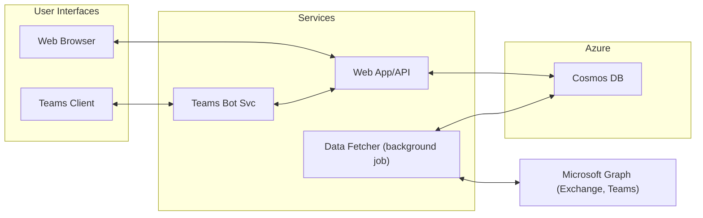

# WOLA (Work Out Loud Agent) - Solution Architecture

## Overview
This document describes the solution architecture for WOLA, an agentic AI system that generates daily work summaries for individual users by aggregating data from Microsoft Exchange (email and calendar) and Microsoft Teams. The solution is designed for Azure, with support for local development using emulators where possible.

---

## 1. High-Level Architecture

- **User Interfaces:**
  - Microsoft Teams Bot (for authentication, onboarding, and future interactions)
  - Web App (dashboard for viewing summaries)
- **Authentication:**
  - Azure Entra ID (Azure AD) Single Sign-On (SSO) for both Teams bot and web app
- **Data Sources:**
  - Microsoft Graph API (for Exchange email, calendar, and Teams messages)
- **Processing:**
  - Backend service (API + background jobs) to fetch, process, and summarize data
- **Storage:**
  - Azure Cosmos DB (for storing summaries, user profiles, and manual corrections)
- **Notifications:**
  - Email (for daily summary delivery and activity prompts)
- **Hosting:**
  - Azure App Service (Web App + API)
  - Azure Bot Service (Teams bot)
  - Local development: Azure Functions/Services emulators where possible, otherwise cloud resources

---

## 2. Component Diagram

---

## 3. Component Descriptions

### 3.1 Teams Bot Service
- Provides onboarding, authentication, and (future) user interaction via Teams
- Uses Azure Entra ID SSO for authentication
- Hosted on Azure Bot Service

### 3.2 Web App & API
- Simple dashboard for viewing daily summaries
- API endpoints for user profile, summary retrieval, and manual corrections
- Uses Azure Entra ID SSO for authentication
- Hosted on Azure App Service

### 3.3 Data Fetcher (Background Job)
- Periodically fetches data from Microsoft Graph API (sent emails, calendar events, Teams messages)
- Processes and groups activities by customer (email domain/calendar invite)
- Detects leave days and no-activity days
- Generates Markdown summaries and stores them in Cosmos DB
- Triggers email delivery of daily summaries and prompts if no activity is detected

### 3.4 Storage (Cosmos DB)
- Stores user profiles, daily summaries, and manual corrections
- Supports historical access and retention policies

### 3.5 Notifications
- Sends daily summary and activity prompts via email
- (No Teams notifications at this stage)

### 3.6 Authentication
- Azure Entra ID SSO for both Teams bot and web app
- Uses OAuth2 flows compatible with Microsoft Teams and web applications

### 3.7 Local Development
- Use Cosmos DB Emulator and Azure Functions/Services emulators where possible
- If emulators are not available, use Azure cloud resources

---

## 4. Data Flow

1. User authenticates via SSO in Teams or web app
2. Data Fetcher (background job) uses Microsoft Graph API to collect sent emails, calendar events, and Teams messages
3. Activities are grouped by customer (email domain/calendar invite)
4. Summaries are generated in Markdown and stored in Cosmos DB
5. Daily summary is emailed to the user and available in the dashboard
6. If no activity is detected, user is prompted via email
7. User can view summaries and make manual corrections via the web app

---

## 5. Security & Compliance
- All authentication via Azure Entra ID SSO
- Minimal Microsoft Graph API permissions requested
- Data stored in Cosmos DB with Azure security best practices
- No special compliance or anonymization requirements

---

## 6. Scalability & Reliability
- Designed for individual use (single-user per deployment)
- Azure App Service and Cosmos DB provide scalability for future needs
- Background jobs handle API failures gracefully with retries

---

## 7. Extensibility
- No plugin or integration support planned
- Dashboard is simple; future enhancements can be added as needed

---

## 8. Open Questions / Future Considerations
- Dashboard features and UI/UX to be defined in a future phase
- Retention policy for summaries to be confirmed
- Teams bot may support more interactions in the future

---

## 9. Appendix: Technology Stack
- Azure Container Apps
- Azure Bot Service
- Azure Cosmos DB
- Azure Entra ID (Azure AD)
- Microsoft Graph API
- Python
- Markdown for summary formatting

---

This document provides the solution architecture for WOLA and should be used as the basis for system design and implementation.
